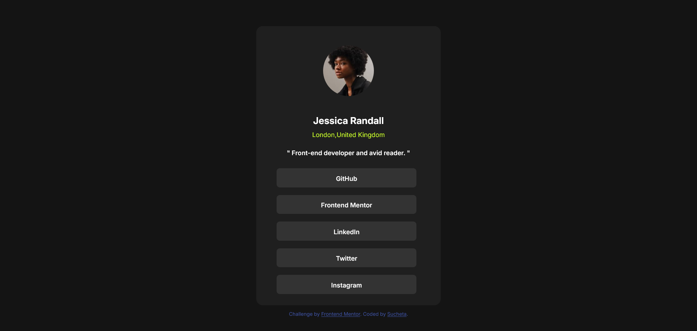

# Frontend Mentor - Social links profile solution

This is a solution to the [Social links profile challenge on Frontend Mentor](https://www.frontendmentor.io/challenges/social-links-profile-UG32l9m6dQ). Frontend Mentor challenges help you improve your coding skills by building realistic projects. 

## Table of contents

- [Overview](#overview)
  - [The challenge](#the-challenge)
  - [Screenshot](#screenshot)
- [My process](#my-process)
  - [Built with](#built-with)
  - [What I learned](#what-i-learned)
  - [Continued development](#continued-development)
  - [Useful resources](#useful-resources)


## Overview
I really liked the challenge of creating buttons in this project.I have earlier created buttons a few times before but after looking at this project I thought I have forgotten how to do it.So wanted to brush up my knowledge on hyperlinks and layout in general.

### The challenge

Users should be able to:

- See hover and focus states for all interactive elements on the page

### Screenshot



### my process
### Built with

- Semantic HTML5 markup
- CSS custom properties

### What I learned
### What I Learned

While styling my project, I noticed that the `<ul>` element containing the link buttons was not aligning properly. There was always extra space on the left side of the buttons.

After researching online, I learned that `<ul>` and `<ol>` elements have default browser styles, including left padding and margins. By default, `<ul>` has a `padding-left` value, which was causing the unwanted spacing.

To fix the issue, I removed the default padding by setting it to `0`.

```css
ul {
  padding: 0;
}
```

This aligned the link buttons properly and helped me understand how default browser styles can affect layout and positioning.


### Continued development
I look forward to doing projects based on box model,flexbox,grid to get a better understanding of these concepts.

### Useful resources
MDN web docs - Helped in better understaning of box model concept regarding unordered list element.

