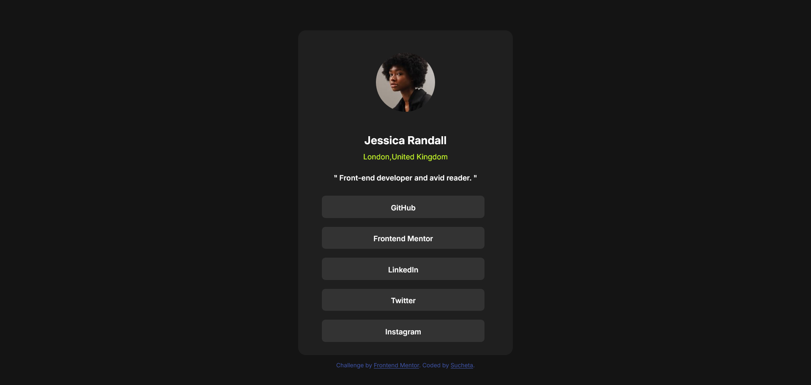

# Frontend Mentor - Social links profile solution

This is a solution to the [Social links profile challenge on Frontend Mentor](https://www.frontendmentor.io/challenges/social-links-profile-UG32l9m6dQ). Frontend Mentor challenges help you improve your coding skills by building realistic projects. 

## Table of contents

- [Overview](#overview)
  - [The challenge](#the-challenge)
  - [Screenshot](#screenshot)
- [My process](#my-process)
  - [Built with](#built-with)
  - [What I learned](#what-i-learned)
  - [Continued development](#continued-development)
  - [Useful resources](#useful-resources)

## Overview
I really liked the challenge of creating buttons in this project.I have earlier created buttons a few times before but after looking at this project I thought I have forgotten how to do it.So wanted to brush up my knowledge on hyperlinks and layout in general.

### The challenge

Users should be able to:

- See hover and focus states for all interactive elements on the page

### Screenshot

### my process
### Built with

- Semantic HTML5 markup
- CSS custom properties

### What I learned

I was not able to align <ul> elements which has link buttons as shown in the preview.There was always space on the left side of the buttons.After searching online came across these lines-
"The <ul> and <ol> elements have a top and bottom margin of 16px ( 1em ) and a padding-left of 40px ( 2.5em ). If the directionality attribute dir is set to right-to-left ( rtl ) for ul and ol elements, in that case padding-right comes into effect and its default value is 40px ( 2.5em ). "
so I set padding of <ul> to zero.This aligned link buttons properly.

ul {
   padding: 0;
}

### Continued development
I look forward to doing projects based on box model,flexbox,grid to get a better understanding of these concepts.

### Useful resources
MDN web docs - Helped in better understaning of box model concept regarding unordered list element.

